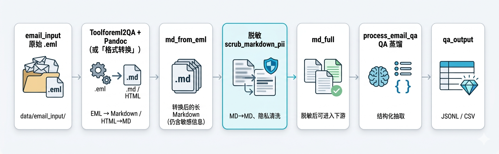

<div align="center">

# 📧 Email2QA

**从 Foxmail 导出邮件到知识库 QA 的自动化流水线**

*转换 → 脱敏 → 蒸馏：把凌乱、多语种、含隐私的 `.eml`，变成可入库的结构化 QA。*

[](https://www.python.org/)
[](LICENSE)
[](https://github.com/lez666/Email2QA)

[简体中文](README.md) · [English](README_EN.md) · [日本語](README_JA.md)

</div>

---

## 🌟 核心亮点

| | |
| :--- | :--- |
| 🛡️ **隐私可控** | 脱敏步骤 **兼容 OpenAI 接口**：可接 **内网 vLLM / Ollama**（`OPENAI_BASE_URL`），敏感原文不必出内网；也支持默认走云端 API，按合规自选。 |
| 🧩 **格式保真** | HTML 正文经 **pandoc** 转 Markdown，尽量保留代码块、列表与结构（见 `tools/Toolforeml2QA/`）。 |
| 🧠 **面向邮件的 Prompt** | `prompts/distill_emails_system.txt` 等针对技术支持邮件场景调优，输出统一 QA 字段。 |
| ⚡ **断点续跑** | `scripts/process_email_qa.py` 会跳过 JSONL 中已出现过的 `file`；`scrub` 支持跳过已生成目标文件（`--overwrite` 可强刷）。 |
| 📁 **目录约定清晰** | **`.eml` 固定放 `data/email_input/`**，其余路径见下文「数据目录」一节。 |

---

## 🔄 处理工作流

<div align="center">



</div>

> **说明**：脱敏与 QA 默认共用 `secrets/openai_key.txt`；若脱敏走内网模型，请为该步骤配置 `OPENAI_BASE_URL` / `openai_base_url.txt`，避免误将敏感 MD 发到错误端点。详见 [secrets/README.md](secrets/README.md)。

---

## 🚀 快速开始

### 1️⃣ 环境准备

```bash
pip install -r requirements.txt
```

- **pandoc**（邮件正文为 HTML 时需要）：  
  `sudo apt install pandoc`（Ubuntu） / `brew install pandoc`（macOS）

### 2️⃣ 放入原始邮件

将 Foxmail 等导出的 **`.eml`** 放入：

```text
data/email_input/
```

（可建子目录分类；克隆本仓库后 `data/email_input/` 等流水线目录已随 `.gitkeep` 建好。）

> **只想演示流水线？** 可使用仓库内**虚构、去标识化**样例 **`data/email_input_demo/`**（20 封 `.eml`）。人名、域名、SN 与商业情节均为测试占位，不对应真实客户；构造原则与安全说明见 [data/email_input_demo/README.md](data/email_input_demo/README.md)。输出请用独立目录（如 `data/md_from_eml_demo`），避免覆盖真实数据。

### 3️⃣ 三步流水线

**第一步 — EML → Markdown（无 LLM）**

```bash
mkdir -p data/email_input data/md_from_eml
chmod +x tools/Toolforeml2QA/batch-eml2md.sh
./tools/Toolforeml2QA/batch-eml2md.sh data/email_input data/md_from_eml
```

**第二步 — MD 深度脱敏（🛡️ 隐私关键步骤）**

```bash
# 先配置 secrets/openai_key.txt 或 export OPENAI_API_KEY=...
python scripts/scrub_markdown_pii.py --input-dir data/md_from_eml --output-dir data/md_full
```

💡 **只想在内网脱敏？** 将 `OPENAI_BASE_URL` 指向本地兼容服务（或写入 `secrets/openai_base_url.txt` 一行），并设置 `OPENAI_MODEL` 为本地模型 ID。示例：

```bash
export OPENAI_BASE_URL="http://127.0.0.1:8000/v1"
export OPENAI_MODEL="你的本地模型"
python scripts/scrub_markdown_pii.py --input-dir data/md_from_eml --output-dir data/md_full
```

**第三步 — QA 蒸馏（MD → JSONL）**

```bash
python scripts/process_email_qa.py
# 参数说明：python scripts/process_email_qa.py --help
# 试跑前 N 个文件：python scripts/process_email_qa.py --limit 5
```

**可选 — 二次清洗与 Excel**

```bash
python scripts/clean_qa_jsonl.py --src data/qa_output/email_qa.jsonl --dst data/qa_output/email_qa_cleaned.jsonl
# 覆盖重洗（非断点续传）：加 --no-resume
python scripts/export_jsonl_to_csv.py --src data/qa_output/email_qa.jsonl --dst data/qa_output/email_qa.csv
```

EML 工具链见 **[tools/Toolforeml2QA/README.md](tools/Toolforeml2QA/README.md)**；仓库布局见 **[docs/STRUCTURE.md](docs/STRUCTURE.md)**。

---

## 📁 数据目录（`data/`）

本地邮件与中间产物放在 `data/` 下；**默认不提交**敏感内容到 Git（见 `.gitignore`）。**虚构演示**样本（`email_input_demo/`）可随仓库提交。

### 流水线目录（按处理顺序）

| 路径 | 你要做的事 | 敏感程度 |
|------|------------|:--------:|
| `data/email_input/` | 放入 Foxmail 等导出的 **`.eml`**（可建子目录分类；批量转换会递归扫描） | 🔴 高 |
| `data/md_from_eml/` | 由 `tools/Toolforeml2QA` 从 `.eml` 转出的**长 Markdown**（工具生成，勿手抄） | 🟠 中 |
| `data/md_full/` | 由 `scrub_markdown_pii.py` 脱敏后的 MD，再给 `process_email_qa.py` 使用 | 🟢 低 |
| `data/qa_output/` | QA 抽取结果（如 `email_qa.jsonl`） | 🟢 低 |

### 示例与演示（可随仓库提交）

| 路径 | 说明 |
|------|------|
| `data/email_input_demo/` | **虚构、去标识化** `.eml`（当前 20 封）。构造原则与安全说明见 [data/email_input_demo/README.md](data/email_input_demo/README.md)。 |

克隆本仓库后，`email_input`、`md_from_eml`、`md_full`、`qa_output` 四个目录已存在（内为空的 `.gitkeep`，便于 Git 跟踪空文件夹）。若被误删，可执行：`mkdir -p data/email_input data/md_from_eml data/md_full data/qa_output`。

**与 `tools/Toolforeml2QA` 的配合**：邮件正文为 **HTML** 时需要系统已安装 **`pandoc`** 并在 `PATH` 中；纯文本正文不依赖 pandoc。转换命令见上文「快速开始」第一步。

---

## 🧰 脚本与参数（`scripts/`）

在仓库**根目录**执行 `python scripts/…`。脚本通过 `PROJECT_ROOT` 定位仓库根，读取 `prompts/`、`secrets/`、`data/`。

| 脚本 | 作用 | 常用参数 |
|------|------|----------|
| `scripts/scrub_markdown_pii.py` | MD→MD 脱敏（`prompts/scrub_md_pii_system.txt`） | `--input-dir` / `--output-dir`、`--overwrite`、`--limit` |
| `scripts/process_email_qa.py` | 从 `data/md_full/` 抽取 QA（单线程、可续跑） | `--input-dir` / `--output`、`--model`、`--limit` |
| `scripts/clean_qa_jsonl.py` | QA JSONL 二次清洗 | `--src` / `--dst`、`--model`、`--limit`、`--no-resume` |
| `scripts/export_jsonl_to_csv.py` | JSONL → CSV | `--src` / `--dst` |

查看全部参数：

```bash
python scripts/scrub_markdown_pii.py --help
python scripts/process_email_qa.py --help
python scripts/clean_qa_jsonl.py --help
python scripts/export_jsonl_to_csv.py --help
```

**典型顺序**：`scrub_markdown_pii` → `process_email_qa` →（可选）`clean_qa_jsonl` → `export_jsonl_to_csv`（与「快速开始」一致）。

**试跑（省 API）**：如 `process_email_qa.py --limit 3`、`scrub_markdown_pii.py --limit 3`、`clean_qa_jsonl.py --limit 20`。

**全量重跑**：QA 蒸馏请备份或删除 `data/qa_output/email_qa.jsonl` 后再运行 `process_email_qa.py`；清洗可用 `clean_qa_jsonl.py --no-resume` 覆盖 `--dst`。

**Prompt 文件**：`prompts/distill_emails_system.txt`、`prompts/scrub_md_pii_system.txt`、`prompts/clean_qa_items_system.txt`。

---

## ⚙️ 配置与进阶

- **密钥**：在 `secrets/` 下按 [secrets/README.md](secrets/README.md) 创建 `openai_key.txt`（可复制 `*.example.txt`）。支持任意 **OpenAI 兼容**网关。
- **自定义端点**：`OPENAI_BASE_URL` 或 `secrets/openai_base_url.txt`（代理 / 本机 vLLM）。
- **模型名**：`OPENAI_MODEL`（脱敏与 QA 脚本共用该变量约定）。
- **脱敏并发**：`SCRUB_CONCURRENCY`（默认 4）。

---

## ⚠️ 注意事项

1. 脱敏与 QA **默认共用**同一套 Key；若脱敏只走内网，请显式设置 `OPENAI_BASE_URL`，避免误连公网。
2. `scripts/process_email_qa.py` 输出已存在时会按 `file` 字段跳过已处理邮件；全量重跑请先备份或删除原 JSONL。

---

## 📂 仓库结构（摘要）

```
Email2QA/
├── README.md / README_EN.md / README_JA.md
├── LICENSE / requirements.txt / .gitignore
├── docs/                    # 文档与配图
│   ├── STRUCTURE.md         # 本仓库目录说明（更全）
│   └── assets/logicpic.png  # 工作流示意图
├── scripts/                 # Python 流水线入口（从根目录 python scripts/… 运行）
├── tools/Toolforeml2QA/     # .eml → .md（pandoc），可单独拷贝使用
├── prompts/                 # 各阶段系统提示词
├── secrets/                 # 本地密钥（勿提交真实 key，见 secrets/README.md）
└── data/                    # 邮件与中间产物（默认 gitignore；见上文「数据目录」）
```

---

## 🤝 贡献与反馈

若本仓库对你有帮助，欢迎 **Star 🌟**；Bug 与建议请发 **Issue**，改进工具链或 Prompt 欢迎 **Pull Request**。

---

## ⚖️ 许可证

本项目基于 **[MIT License](LICENSE)** 授权。
